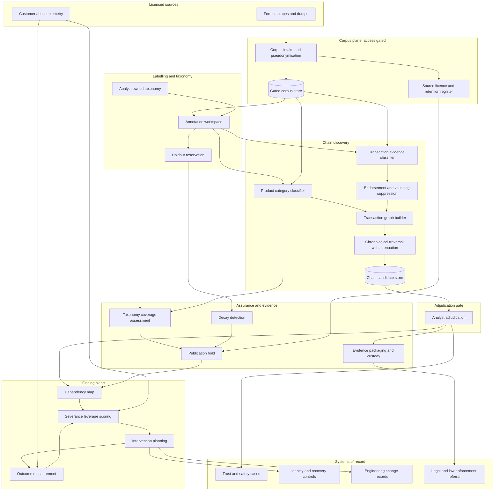

# Cutpoint

**Source:** `ai-in-cyber/1812.00381v2/`
**Domain:** `ai-cyber`
**One-liner:** A disruption-planning workbench that maps which criminal purchase enables which subsequent criminal sale inside underground markets, then ranks control changes by how much downstream harm each one severs — so trust-and-safety and cybercrime teams stop banning sellers one at a time.
**Wedge:** Account-integrity teams at consumer platforms where handles carry resale value — social networks, large gaming publishers, crypto exchanges, and mobile carriers whose number-porting desk sits upstream of account recovery. Accounts are the central traded commodity in both forums the source studied, which makes account-takeover the one chain worth instrumenting first.
**Positioning:** Criminal-market disruption planning, not underground monitoring. Incumbent dark-web products sell an inventory — actors, listings, keyword alerts, leaked credentials — which tells a defender *who is selling what*. Cutpoint sells the edge: the dependency between a purchase and a later sale, adjudicated by an analyst, scored for severance leverage, and carried through to a measured before-and-after on the harm it was supposed to stop. The source's own conclusion is a control change, not an arrest: because stolen high-value handles depend on doxing services and SIM-swap-adjacent recovery paths, the effective mitigation is to stop using mobile phone numbers for account authentication and recovery. That is the shape of every Cutpoint output.

## Market research synthesis

### Thesis from source

The paper's opening economic argument is that Cybercrime-as-a-Service has commoditised attacks into specialised links. Its worked illustration is the spammer, who without commoditisation must personally send email, acquire mailing lists, build storefronts, contract hosting, register domains, fulfil product, accept payments, and run customer service — and who with commoditisation buys each of those from a specialist. The authors' point is that commoditisation is a defensive opportunity as much as an offensive one, because a dependency is a place to apply leverage: undermine the payment channel and the whole chain above it degrades. But the community, the authors argue, has no systematic method for finding those dependencies. Analysts read forums by hand, which the paper repeatedly describes as time-consuming, and the resulting map is anecdotal.

The technical contribution is a pipeline that turns forum text into a dependency graph. A supervised product classifier assigns each thread-opening post to one of fourteen analyst-chosen categories — account, botnet, crypter, DDoS service, hacked server, hack-for-hire, hosting, malware, proxy, social booster, spam tool, traffic, video game service, other — using TF-IDF over character n-grams, which is what makes the method language-agnostic. A second classifier sorts replies into buy, sell, or other, keeping only replies that evidence an actual transaction rather than an expressed intent. Those two outputs build a directed interaction graph of who sold to whom and when, and a modified breadth-first search walks that graph in chronological order to emit supply-chain links: user A sold a category-*a* product to user B, who then sold a category-*b* product to user C. Outlier traders are damped by attenuation — a user appearing in *n* edges contributes 1/*n* to each, so a single buyer who then sells fifty times cannot manufacture fifty findings.

The numbers are modest and honestly reported, and they are the most commercially important part of the paper. On Hack Forums (English, 14,447 threads, April 2009 to April 2015) the pipeline produced 36% relevant links against a 13% baseline; on Antichat (Russian, 73,115 threads, 2005 to 2010) 58% against a 36% baseline. Classifier quality was chosen for precision over recall on purpose: XGBoost gave weighted non-other product precision of 0.824 on Antichat and 0.734 on Hack Forums, while logistic regression gave reply precision of 0.874 and 0.852. Recall is not merely low, it is stated to be incomputable, because there is no efficient way to enumerate all true links. The authors are explicit that their counts are a lower bound. After attenuation, six years of Hack Forums yielded 119 links and seven years of Antichat yielded 441. That is the honest scale of the artefact: a small number of high-confidence dependency edges, not a firehose.

Three findings define the product. First, accounts are the hub of both ecosystems: in Antichat, hacked servers feed accounts (servers are used to brute-force and create them), and accounts feed social boosters; in Hack Forums, accounts and video game services are tightly coupled. Second, the case studies show that an edge can carry a control recommendation that no actor-level report would surface. Buyers of social-booster services groom accounts and resell them at a premium — 3% of the 589 unattenuated Hack Forums links were exactly this pattern — and some of those groomed "eWhore" personas are sold onward to romance scammers, a connection the paper notes was absent from prior work on dating scams. Rare handles, called "OG," are named in 32% of account links, and 60% of links where "OG" appears in the destination originate from an account source; there is a documented chain where a buyer of a doxing service (categorised under hack-for-hire) subsequently sells a stolen OG account. The paper's mitigation follows directly from the edge, not the actor. Third, the pipeline is fragile in specific, plannable ways: the vast majority of the Hack Forums baseline's 86% "lack of purchase" errors came from vouching replies, where reputation-trading gangs endorse each other's posts and look like buyers to a naive parser.

The operating economics are stated plainly enough to build a price around. Annotation dominates: roughly 10 seconds per post, more than 8,000 posts per task, about 2,720 minutes of labelling against roughly 32 minutes of product classification, single-digit minutes of reply classification, and under a minute of graph traversal — about 23 hours end to end per forum, of which nearly all is human. Standing up a new market needs an estimated 6,000 to 8,500 labelled posts, which the authors put at two to three person-days for a domain expert with native fluency in the forum's language. Models do not transfer between forums, so each market pays that toll. And they decay inside a single forum: classifiers trained on posts temporally distant from the test window scored roughly 0.15 F1 on Antichat and 0.05 on Hack Forums, rising to about 0.35 and 0.40 when training data sat close in time. Finally, taxonomy choice bounds everything — the fourteen categories described only about a tenth of Antichat's links, and the authors note that chains they had to discard were interesting: when the platform introduced internal currency, currency-movement services appeared; when it introduced phone verification for registration, SMS-activation and phone-malware chains appeared. Taxonomy is therefore a live control surface in the hands of the analyst, not a fixed schema.

### Buyer & economic model

- **Primary buyer:** Director of Trust & Safety or Head of Account Integrity at a consumer platform. Secondary buyer: Head of Cyber Threat Intelligence at a bank, carrier, or large marketplace, who owns the fraud-loss line rather than the abuse-report queue.
- **Users:** threat intelligence analysts who adjudicate candidate links; trust-and-safety investigators who work the account-takeover queue; abuse and detection engineers who implement the control change; a forum linguist or annotation lead with native fluency who owns each market's labelled corpus; fraud strategy analysts who size the harm; law-enforcement liaison counsel who package referrals; and a data governance owner who signs off on source handling.
- **Budget owner / value metric:** the abuse and fraud-loss budget, not the threat-intel subscription line. The value metric is harm severed per intervention — stolen accounts per month before and after a recovery-flow change, cost per adjudicated chain versus cost per banned seller — and the second-order metric is analyst hours displaced from forum reading, which the source prices for us at roughly 23 hours per market per cycle.
- **Competing status quo:** a dark-web monitoring subscription producing keyword alerts on brand names and credentials, plus an analyst who reads a handful of marketplaces manually and writes a quarterly narrative. Enforcement is actor-level: ban the seller, suspend the listing, file the takedown. The chain is rebuilt by a substitute supplier within weeks, and nobody measures whether it was rebuilt, because the intervention was never tied to a dependency in the first place.

### Domain constraints

- **Regulatory / trust / safety:** source material is often of illicit origin — leaked database dumps and scrapes of public postings — and the paper's own handling model is the compliance floor: analyse no personally identifiable information, anonymise case studies except where already publicly reported, and never expose the corpus in a form indexable by search engines, because indexing multiplies the harm from any PII the dump contains. Anything that leaves the platform toward a law-enforcement referral crosses into evidence handling, where chain of custody, immutability of the retained artefact, and disclosure obligations to a defence apply. Cutpoint plans interventions on the defender's own controls; it never touches a third-party system.
- **Data sensitivity:** forum corpora carry PII belonging to victims and to actors simultaneously, and often carry stolen credentials verbatim. Pseudonymous actor keys must be the working unit, raw dumps must be access-gated and retention-bounded, and per-source records of lawful basis and licence terms must exist before ingestion — the source could not redistribute its own private-company data for exactly this reason.
- **Change-management realities:** the output is a lower bound with unknown recall, so the product must never present coverage as completeness; analysts will lose trust the first time an unadjudicated link is shown as a finding. Each market is its own annotation project with its own taxonomy and its own drift clock. And the receiving side is slow: a recommendation to remove phone-number-based account recovery lands on an identity roadmap, competes with conversion metrics, and needs harm sizing to survive that argument — so the leverage score has to be denominated in the buyer's own loss numbers, not in graph centrality.

## Business requirements

- BR-1: The primary deliverable to a buyer is a ranked list of candidate control changes with an estimated volume of downstream harm each one severs — never a ranked list of actors, listings, or keywords, because actor-level enforcement is the status quo the product is replacing.
- BR-2: No chain may be presented as a finding until a named analyst has adjudicated it, and every adjudicated chain must carry the dated source posts, the assigned categories, and the transaction evidence that produced it, so a finding can be re-argued months later.
- BR-3: The platform must operate a precision-first disclosure policy: published precision per market and per category, an explicit statement that recall is unmeasurable, and coverage reported as a floor. Presenting the chain inventory as a complete map of a market is a reportable misstatement.
- BR-4: Onboarding a new market must be sold as a fixed, time-boxed labelling commitment with a quoted cost, and the platform must report actual annotation effort against that quote, because human labelling is the dominant cost and the only figure a buyer can forecast against.
- BR-5: Analysts must be able to add, split, merge, and retire product categories in their own market without vendor involvement, and the platform must report what share of that market's traffic falls outside the active taxonomy, since taxonomy choice — not model quality — is the binding constraint on coverage.
- BR-6: Each market must carry a re-labelling cadence triggered by measured decay in classification quality rather than by calendar habit, and the platform must refuse to publish new chains from a market whose decay has breached its threshold until the corpus is refreshed.
- BR-7: Reputation-gaming behaviour must not be able to manufacture findings: endorsement and vouching replies must be separated from transaction evidence, and the platform must report how many candidate links it suppressed on that basis, since this was the single largest error source in the source's unfiltered baseline.
- BR-8: A new market in a new language must be onboardable without language-specific engineering work, so that market coverage is limited by analyst availability and lawful access rather than by product roadmap.
- BR-9: Every intervention the customer executes must be recorded with a hypothesis, a baseline harm measurement, and a post-implementation measurement on a defined window, and interventions that fail to move the harm metric must remain visible rather than being quietly dropped.
- BR-10: Referral packages destined for law enforcement or for a platform's legal function must be generated as sealed, hash-verifiable artefacts with a custody log, and their generation must be a privileged, separately logged action.
- BR-11: Source handling must be governed per corpus: recorded lawful basis and licence terms, an access-gated store, an enforced retention window, no PII enrichment, and technical prevention of public indexing — with an attestable record that these held for the life of every finding derived from that corpus.
- BR-12: Commercial terms must be denominated in monitored markets and adjudicated chains, not in alert volume, so that the vendor is not paid more for producing more noise.

## User stories

Canonical user stories live in sibling [USER_STORIES.md](USER_STORIES.md).

## System design

### Overview

Cutpoint runs a per-market loop with a deliberately human bottleneck. A licensed corpus is ingested, pseudonymised, and access-gated. An analyst-owned taxonomy defines the product categories that matter for this market's investigation goals. A labelling workspace produces the market's own training corpus — the product does not pretend a model from another market transfers. Two classifiers then run over the remaining posts and replies: one assigning a product category to each thread-opening post, one deciding whether a reply evidences a completed purchase, a completed sale, or neither, with endorsement and vouching language routed away from transaction evidence. Those outputs assemble a directed transaction graph over pseudonymous actors, and a chronological traversal with outlier attenuation emits candidate chains, each being a buy of one category followed by a sale of another.

Candidates then enter adjudication, which is the product's trust boundary. Nothing downstream of adjudication may be produced from an unreviewed candidate. Accepted chains aggregate into a dependency map, and the leverage engine converts that map into intervention candidates: for a chain whose destination is harm the customer measures, it proposes the defender-side control that removes the upstream dependency and sizes the harm volume that flows through it. The customer selects interventions, the platform captures a baseline, and after the agreed window it takes the after-measurement and writes the result — including the failures — back into leverage scoring. Separately, a governance plane watches the two things that silently break the loop: taxonomy coverage and classification decay, either of which can block publication for that market.

### Actors & boundaries

- **Actors:** threat intelligence analyst, trust-and-safety investigator, abuse detection engineer, annotation lead and forum linguists, fraud strategy analyst, law-enforcement liaison and legal counsel, data governance owner, platform administrator. Criminal-market participants are subjects, never users, and are represented only as pseudonymous actor keys.
- **Trust boundary:** three boundaries, layered. The corpus store is the innermost and most restricted — raw posts, replies, and any PII they contain sit behind gated access with an enforced retention clock, and no enrichment against external identity sources is permitted. Adjudication is the second: candidate chains are internal working material, and only adjudicated chains cross into the finding surface that investigators, engineers, and executives see. The evidence boundary is the third and is one-way: producing a referral package is a privileged, separately logged export that seals and hashes its contents, because after that point the artefact must be provably unchanged.
- **Human-in-the-loop points:** taxonomy definition and revision; corpus labelling and inter-labeller disagreement resolution; chain adjudication, which is mandatory and non-bypassable; intervention selection and the decision to decline one; referral package approval; and lawful-basis sign-off before any corpus is ingested.

### Core capabilities

1. **Corpus intake and source governance** — licensed ingestion of forum scrapes and dumps, pseudonymisation of actor identities, per-corpus lawful basis and retention records, gated access, and technical prevention of public indexing.
2. **Analyst-owned taxonomy management** — create, split, merge, and retire product categories per market, with versioning so that a chain adjudicated under an older taxonomy remains interpretable.
3. **Labelling workspace and budget control** — batch assignment to fluent labellers, effort tracking against the committed onboarding budget, inter-labeller disagreement surfacing, and holdout reservation.
4. **Product and transaction classification** — category assignment for thread-opening posts and buy/sell/neither classification for replies, tuned for precision, with endorsement and vouching language explicitly separated from transaction evidence.
5. **Transaction graph construction** — a directed, time-stamped graph of pseudonymous actor-to-actor sales derived from classified posts and replies.
6. **Chain discovery with attenuation** — chronological traversal emitting buy-then-sell candidate links, with outlier traders damped so that a single high-volume actor cannot dominate the map.
7. **Chain adjudication** — mandatory analyst review with typed accept and reject reasons, feeding both the finding surface and the next labelling cycle.
8. **Dependency mapping and leverage scoring** — aggregation of adjudicated chains into a category-level dependency map, and scoring of severance leverage in the customer's own harm units.
9. **Intervention planning and outcome measurement** — proposal of defender-side control changes, baseline capture, post-window measurement, and retention of declined and failed interventions.
10. **Coverage and drift assurance** — measurement of the share of market traffic outside the active taxonomy, decay detection against recent holdouts, and publication blocking when thresholds or retention windows are breached.
11. **Evidence packaging and custody** — sealed, hash-manifested referral artefacts with an append-only custody log and privileged-action logging.
12. **Case and workflow integration** — linkage of findings to trust-and-safety cases and of interventions to engineering change records.

### Conceptual data

- **Primary entities:** Market, Corpus, SourceLicence, RetentionPolicy, Post, Reply, Actor, ProductCategory, Taxonomy, TaxonomyVersion, AnnotationBatch, PostLabel, ReplyLabel, LabellerAgreement, ClassificationRun, Transaction, ChainCandidate, ChainAdjudication, DependencyEdge, InterventionCandidate, Intervention, HarmBaseline, OutcomeMeasurement, CoverageAssessment, DriftAssessment, EvidencePackage, CustodyEvent, PublicationHold.
- **Critical events:** corpus ingested with lawful basis recorded; taxonomy version published; annotation batch completed against budget; classification run completed with precision recorded; transaction edge asserted; chain candidate emitted; chain adjudicated or rejected with reason; candidate suppressed as endorsement rather than purchase; dependency edge weight changed; intervention proposed, selected, declined, or implemented; harm baseline captured; outcome measured; coverage or drift threshold breached; publication hold applied or lifted; evidence package sealed; custody transferred; retention window expired and corpus purged.
- **Retention / audit needs:** raw posts and replies carry the shortest retention consistent with the source licence and are purged on expiry, while the derived, pseudonymised artefacts an analyst reasoned over — labels, adjudications, dependency edges, and the evidence hashes — must outlive the raw corpus so that a historical finding remains defensible after purge. Adjudications, interventions, and outcome measurements are append-only, because the commercial claim is longitudinal. Custody logs and privileged-action logs are immutable and retained for the full disclosure window of any referral they touch. Coverage and drift assessments are retained per market for the life of the engagement, since they are the honest bound on every coverage claim the product makes.

### Integrations (conceptual)

- **Systems of record:** the platform's trust-and-safety case management system, the identity and access platform whose recovery and authentication flows are the usual intervention target, the fraud-loss ledger that supplies harm baselines, and the engineering change management system where an implemented control change is recorded.
- **Upstream signals:** licensed forum scrapes and dumps, commercial underground-market data agreements, the customer's own account-takeover and abuse telemetry used to define the harm metric a chain terminates in, carrier and number-porting signals where the recovery path runs through a phone number, and published threat reporting used to corroborate a chain an analyst has adjudicated.
- **Downstream actions:** control-change proposals into the identity or platform roadmap, case linkage into trust-and-safety enforcement, harm-metric monitoring subscriptions that produce the after-measurement, sealed referral packages to legal or law enforcement, and executive reporting on harm severed against cost.

### High-level architecture

Two properties drive the shape. First, the corpus plane and the finding plane must be separable, because the corpus is the most sensitive and shortest-lived thing in the system while findings must survive it. Second, adjudication is a hard gate rather than a review step — the discovery pipeline writes only candidates, and nothing else in the system may read from the candidate store.

### Success metrics

- **Leading:** share of chain candidates adjudicated within the review window; adjudication acceptance rate per market and per category, tracked against the source's 36% and 58% relevance benchmarks; candidates suppressed as endorsement rather than purchase; share of market traffic outside the active taxonomy; time from corpus ingestion to first adjudicated chain; annotation effort consumed against the committed onboarding budget; days since last re-labelling relative to each market's decay threshold; number of interventions with a captured baseline awaiting measurement.
- **Lagging:** harm severed per implemented intervention, measured as the change in the customer's own account-takeover or fraud-loss metric across the agreed window; share of implemented interventions that moved their target metric at all; cost per adjudicated chain against the roughly 23 analyst-hours per market per cycle the source documents for the manual path; substitution rate, meaning how often a severed chain reappeared through a different supplier; referral packages accepted without evidentiary challenge; and repeat-cycle retention, since a market that stops yielding new chains should be exited rather than renewed.

## OpenAPI skeleton

Canonical HTTP surface lives in sibling [openapi.yaml](openapi.yaml). Summary:

- **Base path:** `/v1/...`
- **Auth:** `X-API-Key` for corpus intake connectors and telemetry integrations; Bearer JWT for analyst, investigator, and administrator sessions, with privileged scopes required for evidence packaging and corpus access.
- **Resource groups:** Markets, Taxonomy, Annotation, Chains, Dependencies, Interventions, Assurance, Evidence.
