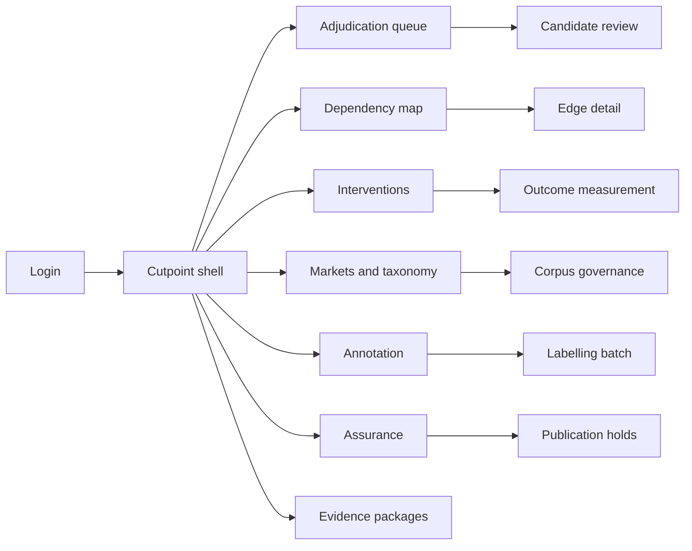
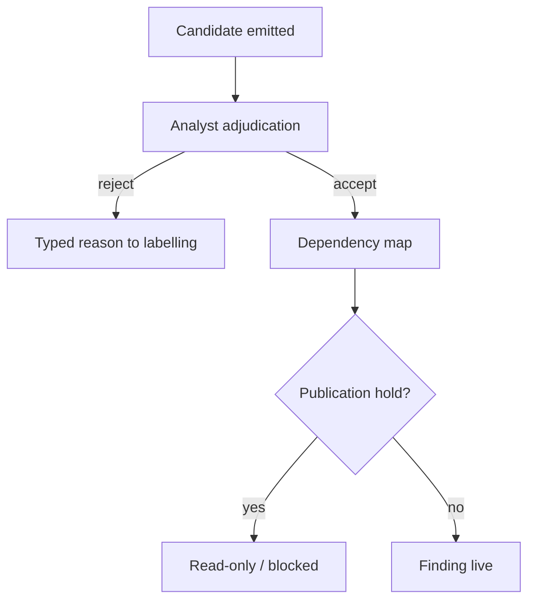
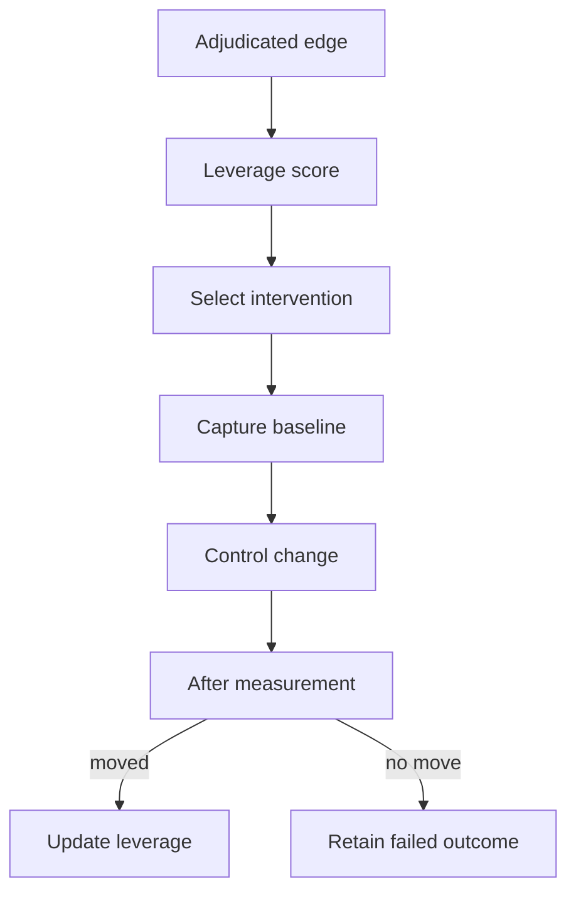

# Cutpoint — Web app

**Product:** [PRODUCT.md](./PRODUCT.md)
**Primary surface:** Disruption-planning workbench (analyst adjudication → dependency map → intervention outcomes)
**Secondary surfaces:** Privileged evidence-package viewer (sealed referral artefacts); annotation lead project console (labelling budget)
**Design thesis:** Cutpoint is a lever-finding table, not a dark-web feed. The visual metaphor is a cut wire on a supply-chain schematic — edges that survive adjudication are thick and dated; severed interventions fade the downstream path and keep the before/after harm numbers visible. Ground is deep charcoal with cold cyan for adjudicated edges and signal-amber for publication holds; brand wordmark sits as a quiet stamp on every finding and referral screen so legal and T&S know whose custody they are reading.

## UX research synthesis

### Category peers (best-in-class)

- **Maltego:** Entity-link graphs with transform history and exportable investigation graphs. Steal: side-by-side evidence panes on an edge, not a detached “alert detail”; reject Maltego’s transform-shopping chrome that implies endless discovery coverage.
- **Recorded Future Intelligence Cloud:** Analyst notebooks, entity timelines, and precision language around intelligence confidence. Steal: explicit confidence / precision callouts next to every published claim; reject keyword-alert firehoses as the home screen.
- **Flashpoint Ignite:** Underground community context with human-curated collections and access-gated source handling. Steal: corpus access as a first-class gated workspace; reject actor-leaderboard aesthetics that reward chasing sellers.
- **IBM i2 Analyst’s Notebook:** Chronological link analysis with typed relationships and court-oriented exports. Steal: typed buy→sell edges with timestamps and attenuation notes; reject freeform whiteboard sprawl as the only view.

### Patterns to adopt / reject

- **Adopt:** Adjudication as a hard gate before anything is a finding; dual-pane post + reply evidence; taxonomy coverage and drift as blocking banners; leverage ranked in customer harm units; append-only intervention outcomes including failures; sealed referral with hash manifest.
- **Reject:** Actor/listing inventory as primary nav; “complete market map” claims; alert-volume KPIs; purple AI insight cards; editable adjudicated findings; searchable public corpus browsers.

### Trust, density, and workflow constraints from PRODUCT.md

Findings are a lower bound with unmeasurable recall (BR-3): every published surface must show precision floors and “coverage is incomplete” chrome. Unadjudicated candidates never appear on investigator or engineer homes (BR-2). Corpus PII stays behind gated access with retention clocks (BR-11); referral generation is privileged and separately logged (BR-10). Annotation is the dominant cost (BR-4), so labelling progress vs committed budget is always visible. Drift or taxonomy breach blocks publication (BR-6, BR-5), not a soft warning buried in settings.

## Information architecture

### Nav model

### Roles → default home

| Role | Default home | Why |
|------|--------------|-----|
| Threat intelligence analyst | Adjudication queue | Mandatory gate before findings (BR-2) |
| Trust & safety investigator | Dependency map filtered to platform-touching edges | Acquisition path for cases |
| Abuse detection engineer | Interventions | Control changes with harm volume (BR-1, BR-9) |
| Annotation lead / forum linguist | Annotation batches | Budgeted labelling (BR-4) |
| Fraud strategy analyst | Interventions outcomes | Harm severed metric |
| Compliance / data governance | Assurance + corpus governance | Lawful basis and holds (BR-11) |
| Legal / LE liaison | Evidence packages | Privileged sealed artefacts (BR-10) |

### Cross-links to OpenAPI resources

| Nav area | OpenAPI tags / resources |
|----------|---------------------------|
| Markets, corpora | Markets |
| Taxonomy versions | Taxonomy |
| Labelling batches, agreement | Annotation |
| Candidates, adjudication | Chains |
| Dependency map / edges | Dependencies |
| Intervention candidates & outcomes | Interventions |
| Coverage, drift, publication holds | Assurance |
| Sealed referral packages | Evidence |

## Screen inventory

### Adjudication queue

- **Purpose:** Work candidate chains to accept/reject with typed reasons; nothing here is yet a finding.
- **Entry:** Analyst default home; deep link from classification-run completion.
- **Layout regions:** Queue (market, categories, attenuation weight, age); dual evidence panes (originating post + buy reply + subsequent sale); category chips; reject-reason panel; precision floor banner for this market.
- **Primary actions:** Accept; reject with reason; suppress as vouching/endorsement; open taxonomy note.
- **Empty / loading / error:** Empty = “queue clear — next classification run”; loading = skeleton dual panes; error = retry with request id, candidate remains locked.
- **BR / story ties:** BR-2, BR-7; TI analyst stories.

### Candidate review (single chain)

- **Purpose:** One-screen adjudication with dated source posts, assigned categories, and transaction evidence side by side.
- **Entry:** Queue row; deep link from case linkage later.
- **Layout regions:** Chronology strip (buy → sell); actor keys (pseudonymous only); attenuation explanation; related candidate siblings; audit note field.
- **Primary actions:** Adjudicate; pin to investigator case draft; flag taxonomy ambiguity.
- **Empty / loading / error:** Missing source posts (retention purge) = show retained hashes + “raw purged” state, block accept if policy requires live text.
- **BR / story ties:** BR-2; investigator path stories.

### Dependency map

- **Purpose:** Category-level dependency map of adjudicated chains only — hub vs coincidence at a glance.
- **Entry:** Analyst/investigator nav; filter from market selector.
- **Layout regions:** Directed category graph; volume and attenuation legend; “outside taxonomy” share callout; edge list with harm denominators when mapped; publication-hold banner when active.
- **Primary actions:** Open edge; propose intervention; export map snapshot for exec brief.
- **Empty / loading / error:** Empty = no adjudicated edges yet (not “market is quiet”); hold applied = map read-only with reason.
- **BR / story ties:** BR-1, BR-3, BR-5; hub-vs-coincidence stories.

### Intervention planning

- **Purpose:** Ranked control-change candidates sized in customer harm units, not actor rankings.
- **Entry:** From dependency edge; Interventions nav; engineer home.
- **Layout regions:** Ranked list (severance volume, control surface: auth/recovery/rate-limit); hypothesis editor; baseline capture panel; decline-with-reason path; link to engineering change id.
- **Primary actions:** Select intervention; capture baseline; decline; open outcome window settings.
- **Empty / loading / error:** Empty = map has edges but none mapped to a harm metric — prompt to connect fraud-loss ledger.
- **BR / story ties:** BR-1, BR-9; abuse engineer stories.

### Outcome measurement

- **Purpose:** Before/after harm on a defined window; failures stay visible.
- **Entry:** Intervention detail; fraud strategy home shortcut.
- **Layout regions:** Baseline vs after chart; window dates; pass/fail against hypothesis; substitution check (chain rebuilt via other supplier); append-only outcome log.
- **Primary actions:** Confirm after-measurement; mark failed-visible; feed score refresh.
- **Empty / loading / error:** Awaiting window = countdown state, not blank.
- **BR / story ties:** BR-9; lagging success metrics.

### Markets and taxonomy

- **Purpose:** Own categories per market — add, split, merge, retire — with version history.
- **Entry:** Markets nav; alert from coverage breach.
- **Layout regions:** Market list (language, precision published, drift status); taxonomy editor; coverage share outside taxonomy; version timeline tied to chains adjudicated under each version.
- **Primary actions:** Publish taxonomy version; merge/split category; view outside-taxonomy samples (gated).
- **Empty / loading / error:** New market = time-boxed onboarding wizard with quoted labelling cost.
- **BR / story ties:** BR-4, BR-5, BR-8.

### Corpus governance

- **Purpose:** Per-corpus lawful basis, licence, retention expiry, no-PII-enrichment attestation.
- **Entry:** Market detail → Corpora; compliance home.
- **Layout regions:** Corpus register; retention countdown; access gate log; indexing-prevention attestation; purge schedule.
- **Primary actions:** Sign lawful basis; request access elevation; confirm purge.
- **Empty / loading / error:** Retention breached = publication hold auto-linked.
- **BR / story ties:** BR-11; compliance stories.

### Annotation workspace

- **Purpose:** Labelling batches against committed budget with disagreement surfacing.
- **Entry:** Annotation lead default; decay alert CTA.
- **Layout regions:** Budget progress (committed vs consumed hours); batch queue; label UI for post/reply; inter-labeller disagreement panel; holdout reservation status.
- **Primary actions:** Assign batch; resolve disagreement; complete batch; trigger re-label from drift.
- **Empty / loading / error:** Over budget = hard stop on new batches until change order.
- **BR / story ties:** BR-4, BR-6; annotation lead stories.

### Assurance (coverage, drift, holds)

- **Purpose:** Make publication honesty operational — precision, unmeasurable recall, floor coverage, decay blocks.
- **Entry:** Assurance nav; blocking banner from any finding surface.
- **Layout regions:** Per-market precision panel; coverage floor; drift vs holdout; vouching-suppression counts; active publication holds with lift criteria.
- **Primary actions:** Acknowledge hold; request re-label; export assurance statement for buyer.
- **Empty / loading / error:** Healthy = explicit “publish allowed” with last assessment timestamp.
- **BR / story ties:** BR-3, BR-6, BR-7.

### Evidence packages

- **Purpose:** Privileged sealed referral artefacts with hash manifest and custody log.
- **Entry:** Privileged role only; from adjudicated chain or intervention.
- **Layout regions:** Package builder (selected chains, hashes); custody timeline; download sealed artefact; privileged-action confirmation.
- **Primary actions:** Seal package; transfer custody; verify hash on open.
- **Empty / loading / error:** Insufficient privilege = hard deny with audit; seal failure = no partial download.
- **BR / story ties:** BR-10; legal/compliance stories.

### Investigator case link

- **Purpose:** Open a T&S case from a platform-touching chain with evidence attached — one record, not two.
- **Entry:** Dependency edge → “Open case”; investigator deep link.
- **Layout regions:** Chain summary; attached evidence refs; case id from SoR; ban-substitution note from prior quarter.
- **Primary actions:** Create/link case; return to map.
- **Empty / loading / error:** Integration down = queue local draft with retry.
- **BR / story ties:** T&S investigator stories; BR-2 evidence durability.

## Key flows

1. **Adjudicate then publish** — candidate queued → dual-pane review → accept/reject → dependency map updates only on accept; failure: publication hold blocks map refresh (drift/retention).

2. **Market onboard** — quote labelling commitment → ingest corpus with lawful basis → taxonomy v1 → annotation batches → classification run → first candidates; failure: over-budget or missing lawful basis stops classification.

3. **Severance intervention** — pick high-leverage edge → propose control change in harm units → capture baseline → implement in identity roadmap → after-window measurement → keep failure visible (BR-9).

4. **Drift block** — holdout decay breaches threshold → publication hold → re-label batch → lift hold → resume chain publication (BR-6).

5. **Referral seal** — privileged user selects adjudicated material → seal + hash manifest → custody log entry → transfer; failure: privilege or incomplete hash aborts with no file.

## Design system

### Tokens (CSS variables)

- `--color-ink: #E6EDF2` — primary text
- `--color-ground: #0A0E12` — app ground
- `--color-panel: #12181F` — panels
- `--color-rule: #2A3540` — dividers
- `--color-edge: #3DB8C5` — adjudicated dependency cyan
- `--color-edge-dim: #1A5C64` — attenuated / historical
- `--color-cut: #C4D4A8` — severed path after successful intervention
- `--color-hold: #D4A017` — publication hold / decay
- `--color-danger: #D64545` — retention breach / privilege deny
- `--color-steel: #8A9BAB` — secondary labels
- `--color-brand: #A8D4D8` — Cutpoint wordmark
- `--font-display: "Source Sans 3", sans-serif` — titles and KPI numerals
- `--font-mono: "Source Code Pro", monospace` — actor keys, hashes, post ids
- `--space-1`…`--space-8`: 4px scale
- `--radius-sm: 3px`; `--radius-md: 6px` — forensic-sharp, not pill-heavy
- `--motion-adjudicate: 160ms ease-out` — accept flash on edge
- `--motion-sever: 280ms ease-in-out` — downstream path fade on cut
- `--motion-hold: 400ms pulse` — amber hold banner attention
- Atmosphere: faint schematic grid (supply-chain paper), soft vignette; no stock “hacker in hoodie” imagery.

### Typography & brand

- Display for harm numerals and screen titles; mono for pseudonymous keys, evidence hashes, custody ids.
- Brand wordmark in shell chrome on finding and evidence surfaces; never replaced by generic “Dashboard” as the strongest mark.
- Login shell: brand-first; one headline (“Cut the dependency, not the seller”); one CTA — no alert-volume stat strips.

### Do / don’t

- **Do:** Keep candidates visually distinct from findings; show precision + “recall unmeasurable” on maps; dual-pane evidence; retain failed interventions; lock sealed packages.
- **Don’t:** Actor leaderboards; purple AI glow; complete-map marketing language; cards for static metrics; emoji threat levels; editable settled adjudications.

### Accessibility & domain trust cues

- Contrast AA+ on cyan/amber/danger against ground; edge state also labelled in text (Adjudicated / Hold / Severed).
- Live regions announce publication holds and retention expiry.
- Focus order follows trust boundary: corpus gate → adjudication → map → intervention → evidence.
- Custody and hash verification exposed for auditors without requiring colour alone.

## Component patterns

- **ChainEvidencePanes** — originating post + buy evidence + subsequent sale, dated.
- **AdjudicationGateBadge** — Candidate vs Finding vs Hold states.
- **DependencyEdge** — directed category link with attenuation weight and volume.
- **LeverageRankRow** — control change + harm units + baseline/after.
- **TaxonomyCoverageMeter** — share of traffic outside active taxonomy.
- **DriftHoldBanner** — blocking publication chrome with lift criteria.
- **AnnotationBudgetBar** — committed vs consumed labelling hours.
- **SealedPackageCard** — hash manifest + custody timeline (privileged).
- **VouchSuppressionStat** — count of endorsement-filtered false purchases.

## Out of scope for v1 web

- Public or SEO-indexable corpus search; end-user victim portals; native mobile investigator apps; automated third-party takedown bots; full SIEM replacement; headset/AR graph theatres; white-label dark-web marketplace UIs for third parties.
